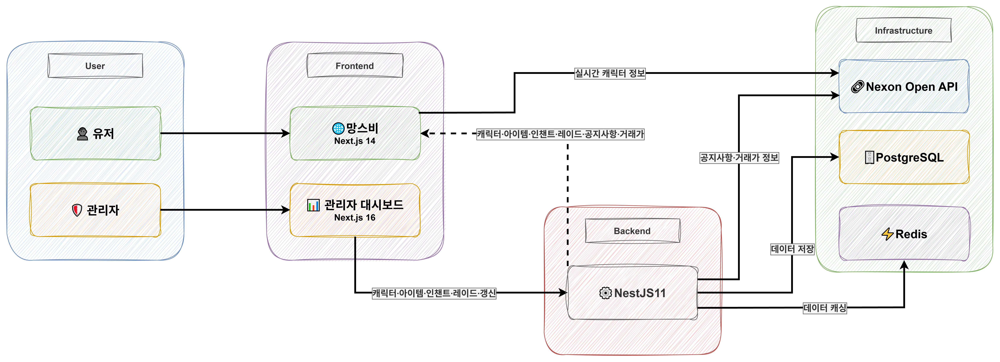
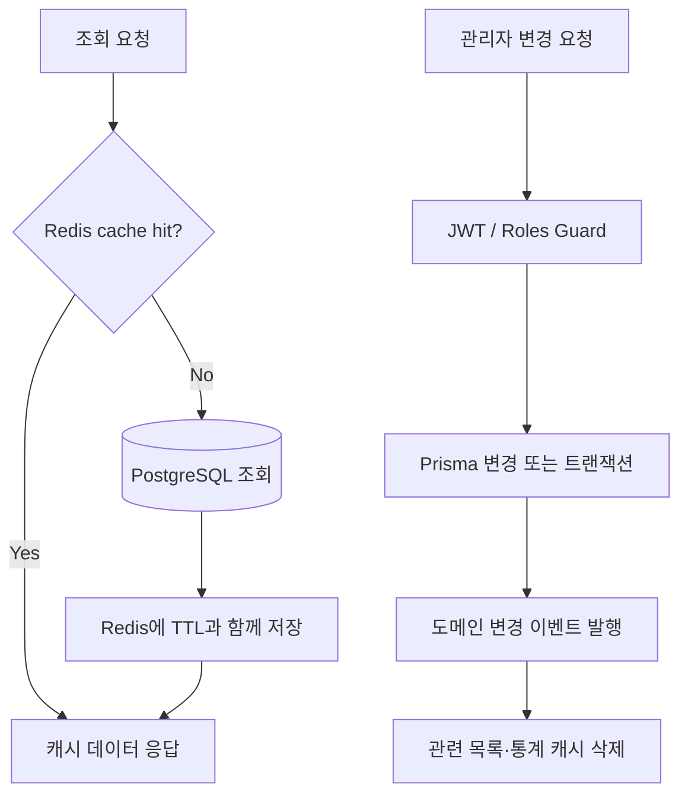
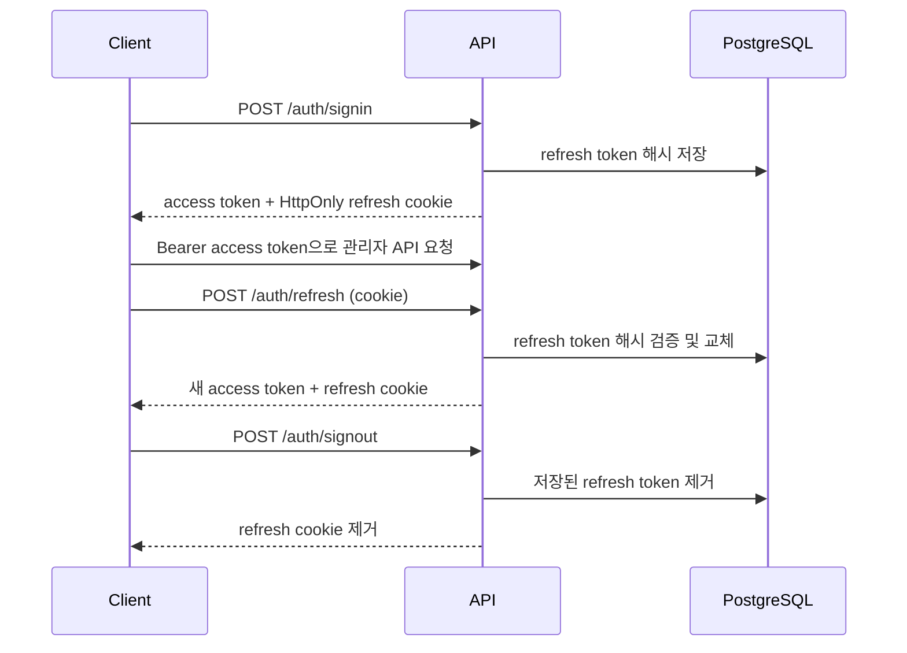

# Heroes API

> 마비노기 영웅전의 캐릭터, 레이드, 아이템, 인챈트 정보를 제공하고 운영자가 데이터를 관리할 수 있도록 만든 백엔드 API입니다. 복잡한 게임 데이터의 관계를 PostgreSQL과 Prisma로 모델링하고, Redis 캐시와 이벤트 기반 무효화를 적용해 조회 성능과 데이터 정합성을 함께 고려했습니다.

[](https://nestjs.com/)
[](https://www.typescriptlang.org/)
[](https://www.postgresql.org/)
[](https://www.prisma.io/)
[](https://redis.io/)
[](https://supabase.com/)

## 프로젝트 정보

| 항목        | 내용                                     |
| ----------- | ---------------------------------------- |
| 프로젝트 명 | 망스비 백엔드                            |
| 개발 기간   | 2026-06-17 ~ 2026-09-17                  |
| 참여 인원   | 1명                                      |
| 기여 범위   | 모든 기능                                |
| 깃허브      | https://github.com/Winter100/heroes-back |
| 배포 URL    | https://api.heroes-dev.com               |

## 주요 기능

- 캐릭터·스킬, 레이드·보상, 아이템·제작법, 인챈트·연마 정보 조회
- 공개 조회 API와 관리자용 생성·수정·삭제 API 분리
- JWT access token, HttpOnly refresh token 쿠키, 역할 기반 접근 제어(RBAC)
- Redis cache-aside 패턴과 도메인 이벤트 기반 캐시 무효화
- Sharp를 이용한 WebP 변환과 Supabase Storage 이미지 관리
- Nexon Open API를 통한 공지 및 거래소 시세 연동
- DTO 검증, 전역 예외 응답, 요청 ID 기반 Pino 구조화 로깅
- 데이터 변경 후 Next.js 페이지를 갱신하기 위한 revalidation API 연동

## 아키텍처



### 조회와 변경 흐름



읽기 작업은 Redis에서 먼저 데이터를 확인하고, cache miss일 때 PostgreSQL을 조회한 뒤 TTL과 함께 결과를 저장합니다. 변경 작업이 완료되면 캐릭터, 아이템, 레이드, 인챈트별 이벤트 핸들러가 관련 목록 및 통계 캐시를 제거합니다. 다음 조회가 최신 데이터로 캐시를 다시 구성하므로 읽기 성능을 확보하면서 오래된 데이터가 남는 시간을 줄였습니다.

## 핵심 데이터 모델

전체 스키마는 게임 정보의 중복을 줄이고 강화 단계, 제작 재료, 드롭 정보처럼 다대다 관계가 필요한 데이터를 연결 모델로 표현합니다.

### 단순화한 아이템 모델


### 단순화한 레이드 모델


### 단순화한 인챈트 모델


## 기술적 의사결정

### 관계형 모델과 트랜잭션

하나의 아이템은 여러 강화 단계와 능력치, 제작 재료를 가질 수 있고 레이드·인챈트 데이터도 서로 연결됩니다. 이를 별도 모델과 복합 유니크 제약으로 표현해 중복과 잘못된 조합을 제한했습니다. 아이템과 기본 강화 단계의 동시 생성, 제작 재료 교체처럼 여러 쓰기가 하나의 작업인 경우 Prisma transaction을 사용해 일부 데이터만 반영되는 상황을 방지했습니다.

```js
// 아이템 생성 트랜잭션
  async create(createItemDto: CreateItemDto, image?: string) {
    return await this.prismaService.$transaction(async (tx) => {
      const createdItem = await tx.item.create({
        data: {
          ...createItemDto,
          image,
        },
      });

      await tx.equipmentStep.create({
        data: {
          itemId: createdItem.id,
          stepName: '0',
        },
      });

      return createdItem;
    });
  }
```

구현 근거: [아이템 레퍼지토리](https://github.com/Winter100/heroes-back/blob/main/src/items/repository/item.repository.ts)

### cache-aside와 이벤트 기반 무효화

목록과 통계처럼 읽기 비중이 높은 결과는 Redis에 캐시하고, Redis 장애가 발생해도 원본 조회를 계속할 수 있도록 캐시 읽기·쓰기 실패를 로깅한 뒤 데이터베이스 조회 결과를 반환합니다. 변경 로직은 캐시 구현에 직접 의존하지 않고 도메인 이벤트를 발행하며, 이벤트 핸들러가 관련 캐시 키를 제거합니다.

```js
async getOrSet<T>(
    key: string,
    ttl: number,
    fetchFn: () => Promise<T>,
  ): Promise<T> {
    if (this.redis.status !== 'ready') {
      return fetchFn();
    }

    try {
      const cached = await this.redis.get(key);
      if (cached !== null) {
        return JSON.parse(cached) as T;
      }
    } catch (err: unknown) {
      return fetchFn();
    }
    const data = await fetchFn();

    if (this.redis.status !== 'ready') return data;

    try {
      const serialized = JSON.stringify(data);
      await this.redis.set(key, serialized, 'EX', ttl);
    } catch (err: unknown) {
    }
    return data;
  }
```

구현 근거: [Redis Service](https://github.com/Winter100/heroes-back/blob/main/src/redis/redis.service.ts), [이벤트로 캐시 제거](https://github.com/Winter100/heroes-back/blob/main/src/redis/cache-invalidation.service.ts)

### access token과 refresh token 분리

API 요청은 Bearer access token으로 인증하고 refresh token은 JavaScript에서 접근할 수 없는 HttpOnly 쿠키로 전달합니다. refresh token 원문 대신 Argon2 해시를 PostgreSQL에 저장하고, 재발급 시 검증한 뒤 토큰을 교체하도록 구성해 저장소 노출 시 위험을 낮췄습니다.

```js
  @UseGuards(LocalAuthGuard)
  @Post('signin')
  async login(
    @Request() req: { user: AuthUser },
    @Res({ passthrough: true }) res: Response,
  ) {
    const { access_token, refresh_token, expiresAt, name, role } =
      await this.authService.signin(req.user);
    res.cookie(
      REFRESH_TOKEN_TITLE,
      refresh_token,
      this.refreshCookieOptions({ expires: expiresAt }),
    );
    return { accessToken: access_token, user: { name, role } };
  }
```

#### 인증 흐름



구현 근거: [Auth Controller](https://github.com/Winter100/heroes-back/blob/main/src/auth/auth.controller.ts), [Auth Service](https://github.com/Winter100/heroes-back/blob/main/src/auth/auth.service.ts)

### 공개 API와 관리자 API 분리

조회 컨트롤러와 관리자 컨트롤러를 분리했습니다. 관리자 API에는 JWT guard와 `ADMIN` 역할 검사를 함께 적용해 인증과 권한 확인의 책임을 공통 계층으로 모았습니다. 요청 DTO는 whitelist, 형 변환, 허용되지 않은 필드 거부를 전역 적용합니다.

```js
// 관리자 API
@Roles(UserRole.ADMIN)
@UseGuards(JwtAuthGuard, RolesGuard)
@Controller('items-admin')
export class ItemAdminController {
  constructor(private readonly itemAdminService: ItemAdminService) {}
  @UseInterceptors(FileInterceptor('image'))
  @Post()
  createItem(
    @Body() createItemDto: CreateItemDto,
    @UploadedFile(ImageValidationPipe) image?: Express.Multer.File,
  ) {
    return this.itemAdminService.createItem(createItemDto, image);
  }
}
```

```js
// 유저용 API
@Controller('items')
export class ItemController {
  constructor(private readonly itemService: ItemService) {}

  @Get('all')
  findAllItems() {
    return this.itemService.findAllItems();
  }
}
```

구현 근거: [Item Admin Controller](https://github.com/Winter100/heroes-back/blob/main/src/items/controller/items-admin.controller.ts), [Item Controller](https://github.com/Winter100/heroes-back/blob/main/src/items/controller/items.controller.ts)

### 운영을 고려한 로깅과 오류 응답

요청의 `X-Request-Id`를 검증하거나 새 UUID를 생성해 응답에도 전달합니다. 비밀번호, 토큰, Authorization 및 Cookie 헤더는 로그에서 마스킹하고 응답 상태에 따라 로그 레벨을 구분합니다. 처리되지 않은 예외도 전역 필터에서 동일한 응답 형태로 변환합니다.

구현 근거: [Exception Filter](https://github.com/Winter100/heroes-back/blob/main/src/all-exceptions.filter.ts), [App Module](https://github.com/Winter100/heroes-back/blob/main/src/app.module.ts)

## API 요약

| 도메인      | 대표 경로           | 주요 기능                                  | 접근 권한                     |
| ----------- | ------------------- | ------------------------------------------ | ----------------------------- |
| 인증        | `/auth`             | 로그인, 토큰 재발급, 로그아웃, 사용자 등록 | 공개 / refresh token / 관리자 |
| 캐릭터      | `/characters`       | 캐릭터·스킬 조회                           | 공개                          |
| 캐릭터 관리 | `/characters-admin` | 캐릭터·스킬 생성, 수정, 삭제               | 관리자                        |
| 아이템      | `/items`            | 아이템, 강화 단계, 제작법, 세트 옵션 조회  | 공개                          |
| 아이템 관리 | `/items-admin`      | 아이템·강화 단계·제작법 관리               | 관리자                        |
| 레이드      | `/raids`            | 레이드, 보상, 드롭 정보 조회               | 공개                          |
| 레이드 관리 | `/raids-admin`      | 레이드와 상세 정보 관리                    | 관리자                        |
| 인챈트      | `/enchants`         | 인챈트, 연마, 거래소 시세 조회             | 공개                          |
| 인챈트 관리 | `/enchants-admin`   | 인챈트 상세 정보 관리                      | 관리자                        |
| 통계        | `/statistics`       | 도메인별 집계 정보 조회                    | 공개                          |
| 공지        | `/notice`           | Nexon 공지·이벤트·패치 노트 조회           | 공개                          |
| 상태 확인   | `/health`           | 애플리케이션 상태 확인                     | 공개                          |

## 로컬 실행

### 요구 사항

- Node.js와 npm
- PostgreSQL
- Redis
- 이미지 업로드 기능 사용 시 Supabase 프로젝트
- 공지·시세 기능 사용 시 Nexon Open API key

### 설치 및 실행

```bash
git clone https://github.com/Winter100/heroes-back.git
cd heroes-back
npm install
npm run migrate:dev
npm run start:dev
```

서버는 `PORT`가 지정되지 않으면 `http://localhost:8080`에서 실행됩니다. `npm install`의 `postinstall` 단계에서 Prisma Client를 생성합니다.

### 환경 변수

저장소 루트에 `.env` 파일을 만들고 아래 값을 설정합니다.

| 변수                          | 필수 여부           | 용도                                     |
| ----------------------------- | ------------------- | ---------------------------------------- |
| `DATABASE_URL`                | 필수                | 애플리케이션용 PostgreSQL 연결 문자열    |
| `DIRECT_URL`                  | 필수                | Prisma migration용 직접 연결 문자열      |
| `REDIS_URL`                   | 필수                | Redis 연결 문자열                        |
| `JWT_ACCESS_SECRET`           | 필수                | access token 서명 키                     |
| `JWT_REFRESH_SECRET`          | 필수                | refresh token 서명 키                    |
| `ACCESS_JWT_EXPIRATION_TIME`  | 필수                | access token 만료 시간                   |
| `REFRESH_JWT_EXPIRATION_TIME` | 필수                | refresh token 만료 시간                  |
| `CORS_ORIGINS`                | 필수                | 쉼표로 구분한 CORS 허용 origin 목록      |
| `SUPABASE_URL`                | 필수                | Supabase 프로젝트 URL                    |
| `SUPABASE_KEY`                | 필수                | Supabase Storage 접근 키                 |
| `NEXON_API_KEY`               | 필수                | Nexon Open API key                       |
| `NEXON_BASE_URL`              | 필수                | 공지 API base URL                        |
| `NEXON_BASE_URL_V2`           | 필수                | 거래소 API base URL                      |
| `FRONTEND_URL`                | 재검증 사용 시 필수 | Next.js revalidation endpoint의 기준 URL |
| `FRONTEND_REVALIDATE_KEY`     | 재검증 사용 시 필수 | 프론트엔드와 공유하는 재검증 키          |
| `PORT`                        | 선택                | 서버 포트, 기본값 `8080`                 |
| `NODE_ENV`                    | 선택                | 로그 레벨과 출력 형식 구분               |

`CORS_ORIGINS`는 여러 프론트엔드 origin을 허용하기 위한 값이고, `FRONTEND_URL`은 서버가 Next.js revalidation endpoint를 호출할 때 사용하는 단일 기준 URL입니다.

### 주요 명령어

| 명령어                   | 설명                                    |
| ------------------------ | --------------------------------------- |
| `npm run start:dev`      | watch mode로 개발 서버 실행             |
| `npm run build`          | NestJS 애플리케이션 빌드                |
| `npm run start:prod`     | 빌드 결과물 실행                        |
| `npm run migrate:dev`    | 개발 데이터베이스 migration 생성·적용   |
| `npm run migrate:deploy` | 운영 데이터베이스에 기존 migration 적용 |
| `npm run lint`           | ESLint 검사 및 자동 수정                |

## 프로젝트 구조

```text
prisma-project/
├─ prisma/                  # Prisma schema와 migration
└─ src/
   ├─ auth/                 # JWT 인증, refresh token, Passport guard
   ├─ characters/           # 캐릭터·스킬 조회 및 관리
   ├─ enchants/             # 인챈트·인퓨전 조회 및 관리
   ├─ items/                # 아이템·강화·제작법 조회 및 관리
   ├─ raids/                # 레이드·보상·드롭 조회 및 관리
   ├─ redis/                # cache-aside와 캐시 무효화
   ├─ supabase/             # 이미지 변환과 Storage 연동
   ├─ nexon/                # Nexon Open API client
   ├─ common/               # 공통 decorator, guard, filter
   ├─ app.module.ts         # 애플리케이션 모듈 구성
   └─ main.ts               # 전역 validation, CORS, bootstrap
```

각 도메인은 Controller–Service–Repository 계층으로 HTTP 요청 처리, 비즈니스 로직, 데이터 접근 책임을 분리합니다. Mapper와 DTO를 통해 데이터베이스 조회 결과를 API 응답 형태로 변환합니다.

## 향후 개선

1. **자동화 테스트 확충** — 인증과 권한, 캐시 장애 fallback, 트랜잭션을 우선으로 단위·통합·E2E 테스트를 추가합니다.
2. **API 문서화** — Swagger를 도입해 요청 DTO, 응답 스키마, 인증 조건을 실행 가능한 API 명세로 제공합니다.
3. **환경 설정 검증** — 애플리케이션 시작 시 환경 변수 누락과 잘못된 형식을 일관되게 검증합니다.
4. **배포 자동화** — build, test, migration 검증을 포함한 CI/CD 파이프라인을 구성합니다.
